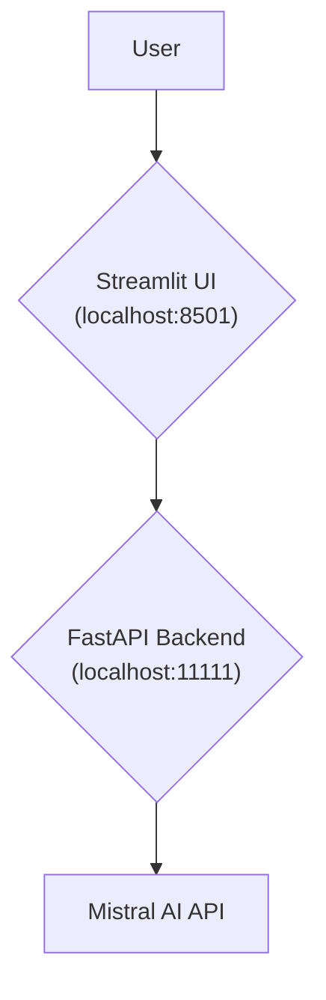
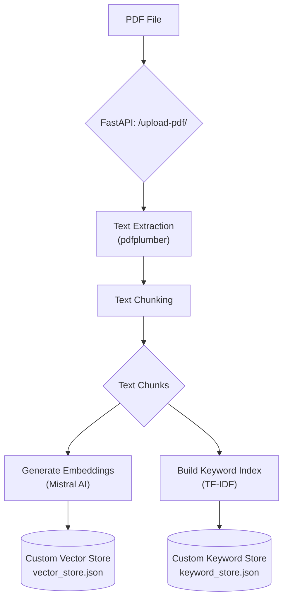
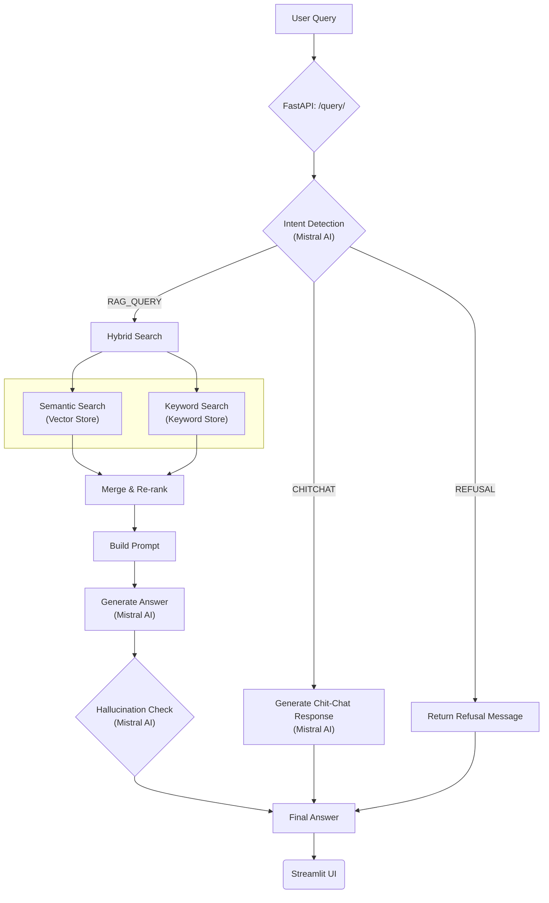

# RAG Pipeline with FastAPI, Streamlit, and Mistral AI

This project implements a complete Retrieval-Augmented Generation (RAG) pipeline from scratch. It uses a FastAPI backend
to handle data ingestion and querying, and a Streamlit frontend for user interaction. The entire system is built in
Python and leverages the Mistral AI API for language modeling and embeddings, without relying on external libraries for
search or RAG orchestration.

Proprietary work for evaluation purposes. All rights reserved. No unauthorized use or distribution.

## License & Ownership

### Copyright © 2025 Visheshank Mishra. All Rights Reserved.
### This project is proprietary and confidential. It is provided solely for demonstration and evaluation purposes. No license is granted, and no rights are transferred.
### Any use, reproduction, distribution, modification, or creation of derivative works, whether direct or indirect, is strictly prohibited without the express written permission of the author.

---

## System Architecture and Diagrams

The system is composed of two main components: a **FastAPI Backend** that serves the RAG pipeline and a **Streamlit
Frontend** that provides a user interface for chatting with the system.

### High-Level System Architecture



### Data Ingestion Pipeline

When a user uploads a PDF, it goes through the following pipeline to be indexed for retrieval.



### Query Processing Pipeline

When a user asks a question, the system follows this process to generate an answer.



---

## How to Run the Project

Follow these steps to set up and run the project locally.

### 1. Prerequisites

- **Python 3.12** is required to run this project.

### 2. Clone the Repository

Clone the [UAT branch](https://github.com/RealVizz/stackai-rag-project/tree/UAT) of the repository:

```bash
git clone -b UAT --single-branch https://github.com/RealVizz/stackai-rag-project.git
cd stackai-rag-project
```

### 3. Set Up a Virtual Environment

It is highly recommended to use a virtual environment to manage dependencies.

```bash
# For Windows
python -m venv venv
venv\Scripts\activate

# For macOS/Linux
python3 -m venv venv
source venv/bin/activate
```

### 4. Install Dependencies

Install all the required Python libraries from the `requirements.txt` file.

```bash
pip install -r requirements.txt
```

### 5. Set Up Environment Variables

Create a `.env` file in the root directory of the project. This file will hold your Mistral AI API key.

```
MISTRAL_API_KEY="your_mistral_api_key_here"
```

*Note: You can use the key `CF2DvjIoshzasO0mtBkPj44fo2nXDwPk` for evaluation purposes.*

### 6. Run the Backend Server

The backend is a FastAPI application. Run it using `uvicorn`.

```bash
uvicorn api_main.main_entry:app --host 127.0.0.1 --port 11111 --reload
```

The server will be running at `http://127.0.0.1:11111`. The `--reload` flag will automatically restart the server when
you make changes to the code.

### 7. Run the Frontend Application

In a **new terminal**, run the Streamlit application.

```bash
python -m streamlit run streamlit_app/app.py
```

The application will usually open in your web browser, at `http://localhost:8501`.

---

## API Endpoints

The FastAPI backend provides the following endpoints:

* `POST /upload-pdf/`: Upload one or more PDF files for ingestion.
* `POST /query/`: Query the system with a user question.
* `POST /get-chat-history/`: Retrieve the chat history for a specific user and chat.
* `POST /get-uploaded-files/`: Get a list of files uploaded to a chat.
* `GET /users/`: Get a list of all user IDs.
* `POST /chats/`: Get all chat IDs for a specific user.

---

## Project Structure

```
.
├── api_main/             # FastAPI Backend
│   ├── data/             # Stop words file
│   ├── db/               # Persisted JSON databases
│   ├── services/         # Core business logic (RAG service)
│   ├── utils/            # Helper modules (PDF, Mistral, DBs)
│   ├── main_entry.py     # FastAPI app definition and endpoints
│   └── schemas.py        # Pydantic models for API requests
├── streamlit_app/        # Streamlit Frontend
│   ├── app.py            # Main Streamlit app router
│   ├── state.py          # Session state management
│   ├── utils.py          # Backend communication helpers
│   └── views.py          # UI components and pages
├── config/               # Project configuration
├── requirements.txt      # Project dependencies
└── README.md             # This file
```
